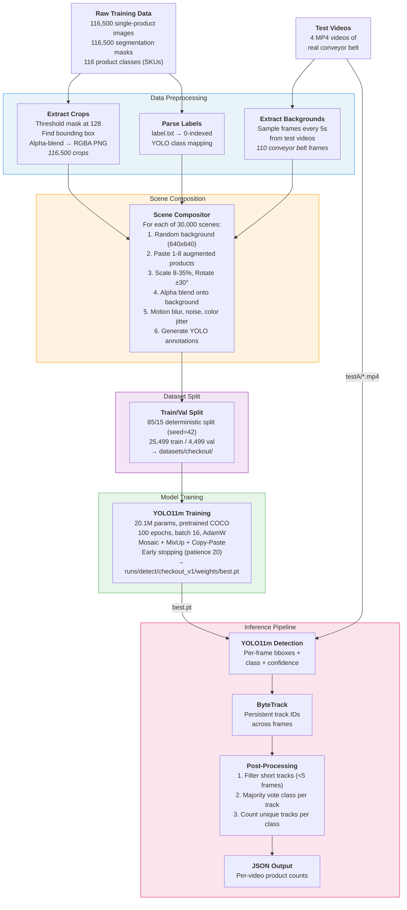
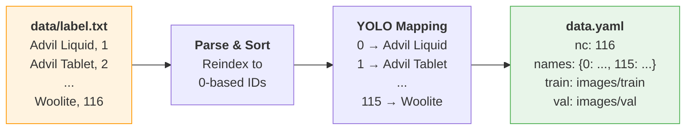
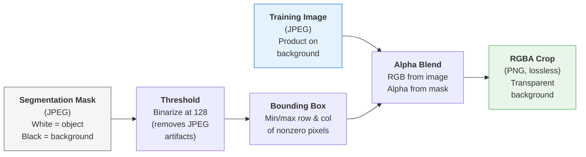
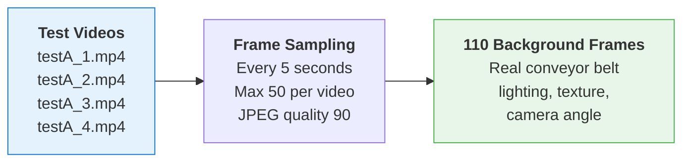
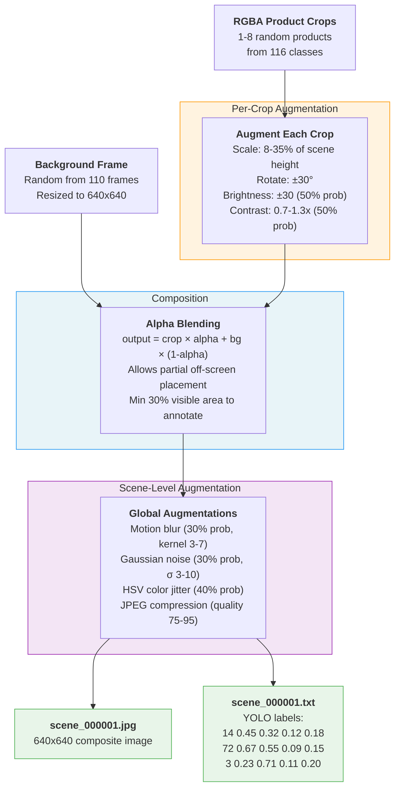
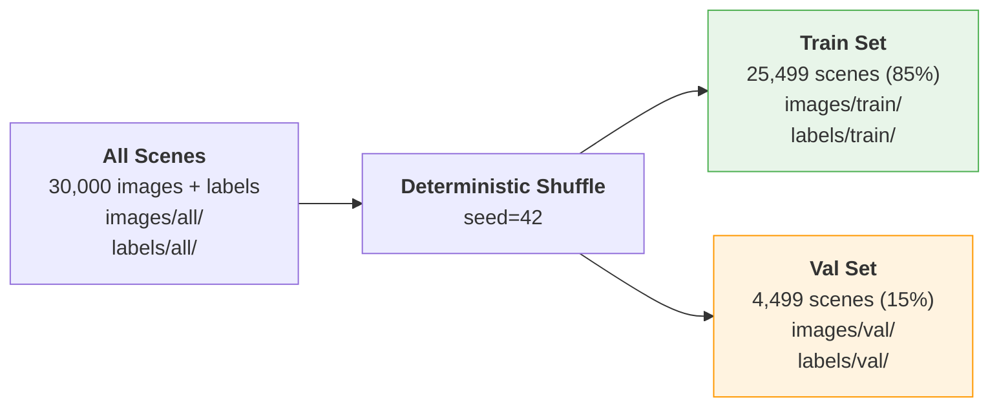
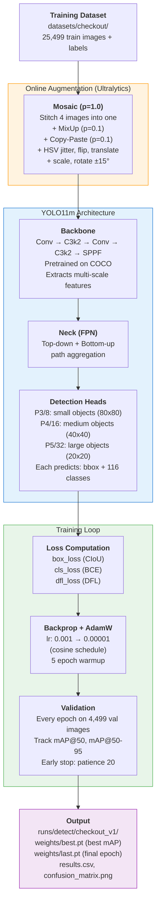
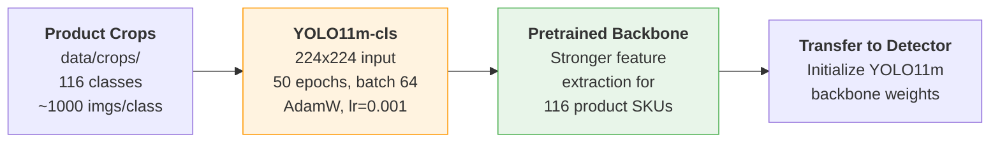
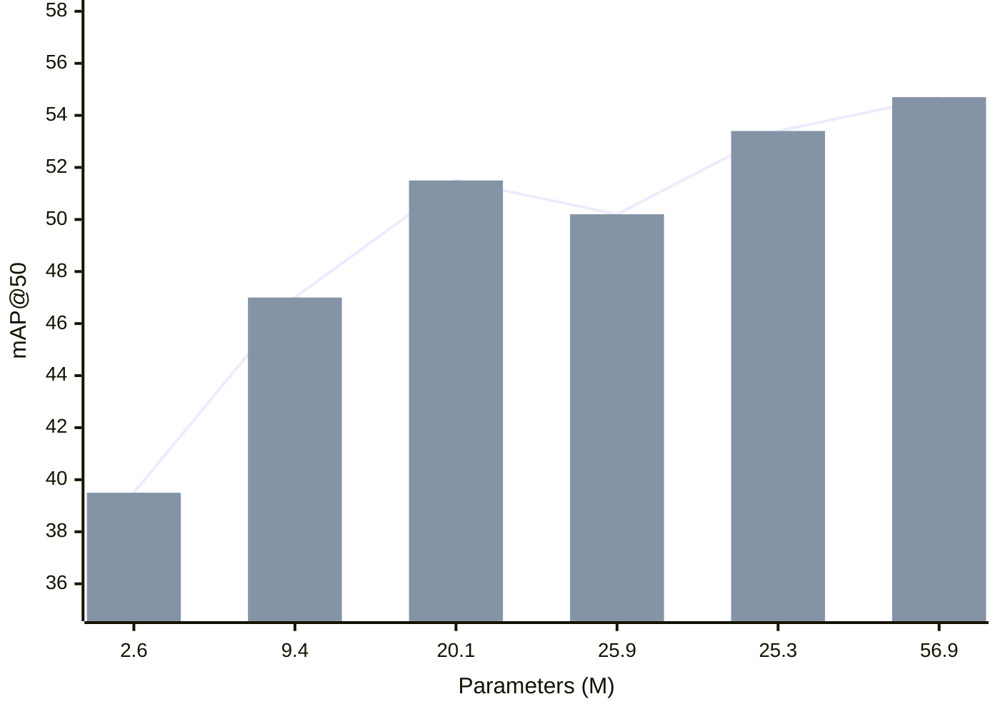
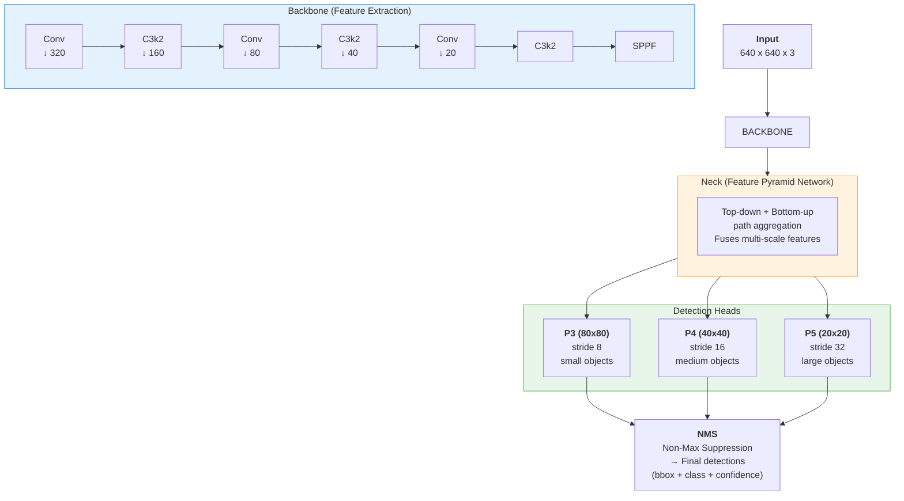

# Automated Retail Checkout

AI-powered product detection, classification, and counting system for retail checkout conveyor belts. Built on YOLO11m with synthetic-to-real domain adaptation and multi-object tracking.

## Problem

Given video footage of products on a moving conveyor belt, detect, classify, and count each product by SKU. The challenge: training data is **single-product synthetic images** while test data is **multi-product real video**. This domain gap drives the entire architecture.

## Architecture

The system is split into two pipelines: a **training pipeline** that transforms single-product images into multi-object training scenes, and an **inference pipeline** that processes video into per-class product counts.

### End-to-End Process Flowchart



---

## Data Preprocessing Pipeline (Detailed)

The preprocessing pipeline transforms 116,500 single-product images into 30,000 multi-object training scenes that resemble real conveyor belt footage. This is the most critical part of the system — the model never sees real labeled data during training, so the quality of synthetic scenes directly determines detection accuracy.

### Stage 1: Label Parsing



**Module:** `src/data_prep/parse_labels.py`

The raw dataset uses 1-indexed class IDs (`1` through `116`). YOLO requires 0-indexed contiguous IDs. The label parser:

1. Reads `data/label.txt` (format: `"ProductName,ID"` per line)
2. Sorts by original ID to ensure deterministic ordering
3. Remaps to contiguous 0-indexed IDs: `{1→0, 2→1, ..., 116→115}`
4. Generates `data.yaml` with the class names, train/val paths, and `nc: 116`

This mapping is used throughout the pipeline — crop extraction uses original IDs (from filenames), scene composition maps them to YOLO IDs, and inference maps YOLO IDs back to human-readable names.

### Stage 2: Crop Extraction



**Module:** `src/data_prep/extract_crops.py`

Each training image has a corresponding segmentation mask. The extraction process:

1. **Threshold the mask** at pixel value 128 to produce a clean binary mask. This is necessary because the masks are stored as JPEG (lossy), so compression artifacts create ~60 intermediate gray values around object edges. The threshold cleanly separates object (white) from background (black).

2. **Compute the bounding box** from the binary mask by finding the min/max row and column coordinates where mask pixels are nonzero.

3. **Crop both image and mask** to the bounding box region.

4. **Create an RGBA image** by concatenating the RGB crop with the mask as the alpha channel. Pixels where the mask is 0 become fully transparent; pixels where the mask is 255 become fully opaque.

5. **Save as PNG** (lossless) organized into class subdirectories: `data/crops/00001/*.png`, `data/crops/00002/*.png`, etc.

Processing is parallelized across 4 worker processes using `ProcessPoolExecutor`, handling all 116,500 images.

**Why RGBA PNG?** JPEG cannot store transparency. When compositing products onto backgrounds, the alpha channel allows clean blending at object edges rather than rectangular cutouts. PNG is lossless, preserving edge quality that would degrade with repeated JPEG re-encoding.

### Stage 3: Background Extraction



**Module:** `src/utils/extract_backgrounds.py`

Test videos show the real conveyor belt environment. We extract frames at 5-second intervals (up to 50 per video) to use as backgrounds during scene composition. This is a key **domain adaptation** technique: by compositing products onto real conveyor belt frames, the training data shares the same lighting, belt texture, camera angle, and background clutter as the test environment.

Note: these frames contain products on the belt, not clean backgrounds. This is intentional — the model learns to detect products in the presence of other partially-visible products, which matches the real test scenario.

### Stage 4: Scene Composition



**Module:** `src/data_prep/scene_compositor.py`

This is the core of the data pipeline. For each of 30,000 scenes:

1. **Select background:** Pick a random frame from the 110 extracted backgrounds, resize to 640x640.

2. **Select products:** Choose 1-8 products at random from any of the 116 classes. Each product is loaded from its RGBA PNG crop.

3. **Augment each crop individually:**
   - **Scale** to 8-35% of the scene height. This range was chosen to match the apparent product sizes on the conveyor belt (products appear small relative to the full frame).
   - **Rotate** by a random angle between -30° and +30° (rotation only applied if angle > 2° to avoid unnecessary interpolation). The rotation expands the canvas to avoid clipping, and the alpha channel is preserved through the affine transform using `borderValue=(0,0,0,0)`.
   - **Brightness/contrast jitter** (50% probability): brightness shifted by ±30, contrast scaled by 0.7-1.3x. Applied only to RGB channels, preserving the alpha.

4. **Paste via alpha blending:** Each augmented crop is placed at a random position on the scene. The placement allows partial off-screen positioning (up to 25% off the left/top edge) to generate realistic partial occlusion. The alpha blending formula is: `output = crop_rgb * alpha + background * (1 - alpha)`.

5. **Validate annotations:** After pasting, each product gets a YOLO-format annotation only if:
   - At least 30% of the crop area is visible (not clipped by scene edges)
   - The bounding box has positive width and height
   - All normalized coordinates are in `[0, 1]`

6. **Apply global scene augmentations:**
   - **Motion blur** (30% probability): Horizontal kernel simulating conveyor belt movement (kernel sizes 3, 5, or 7)
   - **Gaussian noise** (30% probability): Random noise with sigma 3-10, simulating camera sensor noise
   - **Color jitter** (40% probability): HSV-space perturbation — hue +/-10 deg, saturation x0.8-1.2, value x0.8-1.2

7. **Save with JPEG compression:** Quality randomly chosen between 75-95 to simulate varying real-world image quality.

### Stage 5: Dataset Split



**Module:** `src/data_prep/split_dataset.py`

The 30,000 scenes are split into 85% train / 15% validation using a deterministic shuffle (`seed=42`). Only scenes with matching label files are included (scenes where all products were filtered out during composition are skipped). Files are copied (not moved) to preserve the originals for re-splitting.

---

## Training Pipeline (Detailed)

### Training Data Flow



### Hyperparameters

| Parameter | Value | Rationale |
|-----------|-------|-----------|
| **Epochs** | 100 | Upper bound; early stopping usually triggers much earlier |
| **Batch size** | 16 | Maximizes GPU utilization on 16GB VRAM (~8 GB used) |
| **Patience** | 20 | Generous patience avoids premature stopping on noisy val metrics |
| **Optimizer** | AdamW | Better generalization than SGD for fine-grained classification tasks |
| **Learning rate** | 0.001 | Standard for transfer learning from pretrained weights |
| **LR schedule** | Cosine (`lrf=0.01`) | Decays LR from 0.001 to 0.00001 over training |
| **Warmup** | 5 epochs | Prevents early gradient explosions when unfreezing pretrained weights |
| **Image size** | 640x640 | Default YOLO11m resolution; matches scene composition size |

### Augmentation Strategy

The training augmentation operates on two levels:

**Level 1 -- Scene Composition (offline, pre-training):** Products are augmented during scene generation (scale, rotation, brightness/contrast, motion blur, noise, color jitter, JPEG quality). This creates the base diversity in the dataset.

**Level 2 -- YOLO Training (online, during training):** Ultralytics applies additional augmentations on-the-fly:

| Augmentation | Probability | Purpose |
|---|---|---|
| **Mosaic** | 1.0 | Stitches 4 training images into one, increasing object density and context variety |
| **MixUp** | 0.1 | Blends two images with random weight, acting as regularization |
| **Copy-Paste** | 0.1 | Copies objects from one image to another, simulating additional occlusion |
| **HSV jitter** | h=0.015, s=0.5, v=0.3 | Color variation to handle lighting differences |
| **Flip LR/UD** | 0.5 / 0.1 | Orientation invariance (horizontal more likely than vertical) |
| **Translate** | 0.1 | Shifts objects within the frame |
| **Scale** | 0.5 | Varies apparent object size (0.5-1.5x) |
| **Rotation** | +/-15 deg | Additional orientation diversity |

The two-level approach means the model sees far more variation than 30,000 unique scenes -- mosaic alone creates 4^n combinations, and each image is further augmented on every epoch.

### Loss Functions

YOLO11 uses three loss components:

- **Box loss (CIoU):** Complete Intersection over Union -- measures how well predicted boxes match ground truth, accounting for overlap, center distance, and aspect ratio.
- **Classification loss (BCE):** Binary Cross-Entropy per class -- handles the 116-class multi-label prediction.
- **Distribution Focal Loss (DFL):** Refines box regression by learning a distribution over possible offsets rather than a single point estimate.

### Optional: Classification Pretraining



Before detection training, the YOLO11m backbone can optionally be pretrained as a classifier on single-product images. This pretraining step teaches the backbone to distinguish between the 116 SKUs using the clean, single-product crops before the harder multi-object detection task. It operates at 224x224 resolution with larger batch sizes since classification is less memory-intensive.

---

## Model Selection

### Why YOLO11m

The model must balance three constraints:
1. **116 fine-grained classes** -- many visually similar products (e.g., multiple varieties of allergy medicine, similar packaging)
2. **16 GB VRAM** -- RTX 5060 Ti limits the model and batch size
3. **Efficiency matters** -- the challenge scores on both accuracy and speed



> **YOLO11n** (2.6M) · **YOLO11s** (9.4M) · **YOLO11m** (20.1M, selected) · **YOLOv8m** (25.9M) · **YOLO11l** (25.3M) · **YOLO11x** (56.9M)

**YOLO11m was selected because:**

- **Higher accuracy than YOLOv8m** (51.5 vs 50.2 mAP@50) with **fewer parameters** (20.1M vs 25.9M). YOLO11 is a newer architecture with efficiency improvements in the backbone (C3k2 blocks) and neck.
- **Fits comfortably in 16 GB VRAM** at batch 16, using ~8 GB. This leaves headroom for mosaic augmentation which temporarily increases memory usage.
- **Sufficient capacity for 116 classes.** The `nano` and `small` variants risk underfitting on fine-grained SKU differences -- 2.6M and 9.4M parameters respectively are lean for distinguishing 116 visually similar products.
- **Not overkill.** YOLO11l and YOLO11x offer marginal accuracy gains (+1.9 and +3.2 mAP respectively) but require batch size reductions that slow training and hurt mosaic effectiveness.

### Model Architecture



The multi-scale heads are important for this task: products on the conveyor belt vary in size depending on distance from the camera and actual product dimensions. P3 (stride 8) detects small products like gum packets, P5 (stride 32) handles larger items like cereal boxes.

### Alternatives Considered

| Alternative | Pros | Cons | Verdict |
|---|---|---|---|
| **YOLO11l** | +1.9 mAP over 11m | 25.3M params, needs batch 8-12, slower training | **First fallback** if 11m accuracy is insufficient. Switch with one flag: `model=yolo11l` |
| **YOLO11x** | +3.2 mAP (best in family) | 56.9M params, batch 4-8, tight on 16 GB, 2-3x slower | **Second fallback** for maximum accuracy if speed is less critical |
| **YOLOv8m** | Mature ecosystem, extensive community support | Lower accuracy (50.2 vs 51.5 mAP), more parameters (25.9M vs 20.1M) | **Emergency fallback** if YOLO11 has compatibility issues |
| **YOLO11s** | Fast inference, low VRAM (5 GB) | Only 47.0 mAP -- likely underfits 116 fine-grained classes | Not recommended for this task |
| **Two-stage (Detector + Classifier)** | Can use a specialized classifier per product | 2x pipeline complexity, slower inference, harder to optimize end-to-end | Rejected -- challenge weights efficiency alongside accuracy |
| **RT-DETR** | Transformer-based, no NMS needed | Higher VRAM, slower convergence, less battle-tested for production | Could explore if YOLO plateaus |
| **EfficientDet** | Good accuracy/efficiency ratio | Slower than YOLO family, less active development | Superseded by YOLO11 |

The config system makes model switching trivial -- all alternatives that use the YOLO family require only a config override:

```bash
# Try larger model
PYTHONPATH=src uv run python src/training/train_detector.py model=yolo11l training.batch=8

# Try extra-large model
PYTHONPATH=src uv run python src/training/train_detector.py model=yolo11x training.batch=4
```

---

## Project Structure

```
Automated-Checkout/
├── src/
│   ├── data_prep/
│   │   ├── parse_labels.py        # Label file → YOLO class mapping + data.yaml
│   │   ├── extract_crops.py       # Images + masks → RGBA PNG crops (parallel)
│   │   ├── scene_compositor.py    # Crops + backgrounds → composite training scenes
│   │   └── split_dataset.py       # Train/val split (85/15, deterministic)
│   ├── training/
│   │   ├── train_detector.py      # YOLO detection training (Hydra entry point)
│   │   └── train_classifier.py    # Optional classification pretraining
│   ├── inference/
│   │   ├── run_inference.py       # Video → detect → track → count pipeline
│   │   └── counter.py             # Track filtering, majority voting, counting
│   └── utils/
│       ├── extract_backgrounds.py # Extract conveyor belt frames from test videos
│       └── visualization.py       # Debug: draw YOLO boxes on images
├── conf/                          # Hydra configuration
│   ├── config.yaml                # Root config (defaults + global settings)
│   ├── model/                     # Model variants (yolo11m, yolo11l, yolo11x, ...)
│   ├── training/                  # Hyperparams (detect.yaml, classify.yaml)
│   ├── inference/                 # Inference settings (thresholds, tracker)
│   └── data/                      # Dataset paths and composition params
├── tests/                         # 89 unit tests (pytest)
│   ├── data_prep/                 # 56 tests for pipeline modules
│   ├── training/                  # 14 tests for config building
│   └── inference/                 # 19 tests for counting + pipeline
├── data/                          # Raw data (not tracked in git)
│   ├── train/                     # 116,500 training images
│   ├── segmentation_labels/       # 116,500 masks
│   ├── testA/                     # 4 test videos
│   ├── crops/                     # Generated RGBA crops
│   └── backgrounds/               # Extracted conveyor belt frames
├── datasets/checkout/             # Generated YOLO-format dataset
├── runs/                          # Training outputs (weights, metrics)
├── outputs/                       # Inference results (JSON per video)
├── PROJECT_PLAN.md                # Detailed implementation plan
├── CODE_REVIEW.md                 # Codebase review findings
└── pyproject.toml                 # Dependencies and project config
```

## Setup

**Requirements:** Python 3.10+, NVIDIA GPU with CUDA 12.x

```bash
# Install uv (fast Python package manager)
pip install uv

# Install dependencies (including CUDA PyTorch)
uv sync

# Install dev dependencies for testing
uv sync --extra dev
```

## Usage

### 1. Data Pipeline

```bash
# Extract RGBA crops from training images + masks
PYTHONPATH=src uv run python -m data_prep.extract_crops

# Extract background frames from test videos
PYTHONPATH=src uv run python -m utils.extract_backgrounds

# Generate 30,000 composite training scenes
PYTHONPATH=src uv run python -m data_prep.scene_compositor

# Split into train/val
PYTHONPATH=src uv run python -m data_prep.split_dataset
```

### 2. Training

```bash
# Train detection model (default: YOLO11m, 100 epochs)
PYTHONPATH=src uv run python src/training/train_detector.py

# Switch to a larger model
PYTHONPATH=src uv run python src/training/train_detector.py model=yolo11l

# Optional: classification pretraining
PYTHONPATH=src uv run python src/training/train_classifier.py model=yolo11m_cls training=classify
```

### 3. Inference

```bash
# Run inference on all test videos
PYTHONPATH=src uv run python src/inference/run_inference.py

# Adjust confidence threshold
PYTHONPATH=src uv run python src/inference/run_inference.py inference.conf_thresh=0.5
```

### 4. Testing

```bash
uv run pytest                  # Run all 89 tests
uv run pytest -v               # Verbose output
uv run pytest tests/inference  # Run specific module tests
```

## Configuration

All settings are managed via [Hydra](https://hydra.cc/) with composable config groups:

| Config Group | Default | Options | Description |
|---|---|---|---|
| `model` | `yolo11m` | `yolo11l`, `yolo11x`, `yolo8m`, `yolo11m_cls` | Model architecture and image size |
| `training` | `detect` | `classify` | Hyperparameters (epochs, batch, optimizer, augmentations) |
| `inference` | `default` | -- | Confidence/IoU thresholds, tracker, counting params |
| `data` | `checkout` | -- | Dataset paths, scene composition params |

Override any setting via CLI:
```bash
python src/training/train_detector.py model=yolo11l training.batch=8 device=1
```

## Tech Stack

- **Detection:** [Ultralytics YOLO11](https://docs.ultralytics.com/) (detection + tracking)
- **Tracking:** ByteTrack (native Ultralytics integration)
- **Config:** [Hydra](https://hydra.cc/) + OmegaConf
- **Deep Learning:** PyTorch 2.x (CUDA 12.8)
- **CV:** OpenCV, Pillow, Albumentations
- **Package Manager:** [uv](https://docs.astral.sh/uv/)
